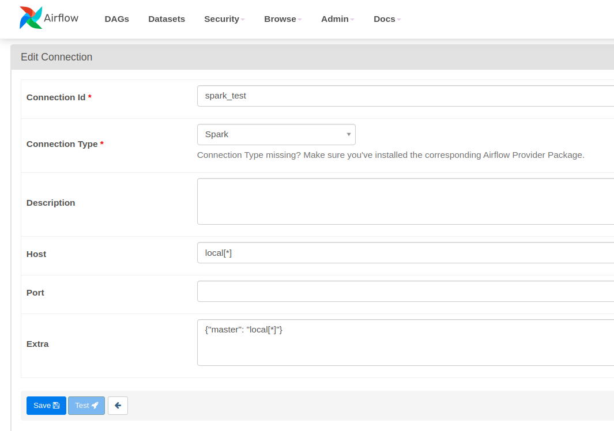

# Airflow and Spark: Running Spark jobs on Airflow (Docker-based solution)
## Things to do;

*  Clone the Github repository 
*  Build the Spark and the Airflow image
*  Create your dags, logs, plugins folder
*  Create your environment variable
*  Start and run the Spark and Airflow containers 
*  Run your Spark jobs to confirm if the Spark job completed successfully before moving it to Airflow 
*  Design the Airflow DAG to trigger and schedule the Spark jobs.

## Build the Airflow image.
```bash
docker build -f Dockerfile.Airflow . -t airflow-spark
```

## Create your dags, logs, plugins folder.
```bash
mkdir ./dags ./logs ./plugins
echo -e "AIRFLOW_UID=$(id -u)\nAIRFLOW_GID=0" > .env
```

## Start and run the Spark and Airflow containers.
```bash
docker-compose -f docker-compose.Spark.yaml -f docker-compose.Airflow.yaml up -d
```
When all the services all started successfully, now go to http://localhost:8080/ to check that Airflow has started successfully, and http://localhost:8090/ that Spark is up and running. 


* Run your Spark jobs to confirm if the Spark job completed successfully before moving it to Airflow.

```bash
docker exec -it <Spark-Worker-Contianer-name> \
    spark-submit --master spark://XXXXXXXXXXXXXX:7077 \
    spark_etl_script_docker.py
```
---
- Create two spark submit operator connection (local and cluster)

